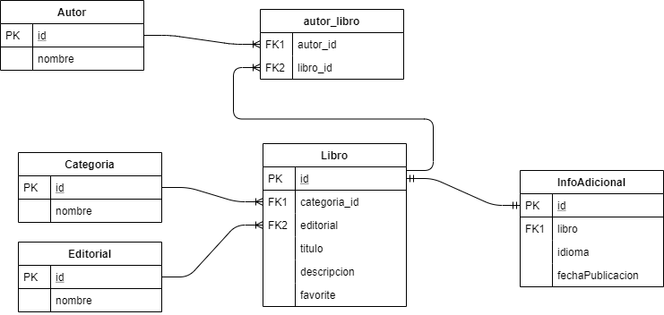

# Getting Started
Proyecto Biblioteca con base de datos Relacional

## Modelo de Datos
En el ejemplo tenemos un modelo de datos relacional con las tablas necesarias para almacenar información para una biblioteca.
Se hace uso de JPA para la creación de las entidades y sus relaciones.

    

Es posible encontrar más información sobre el modelo y las relaciones en [Taller Spring Data JPA](https://github.com/juanmacintas/tallerJPASpringData/)

### Arrancando la aplicación

1. Crear una instancia de base de datos PostgreSQL mediante docker con el comando: 

> docker run -p 5432:5432 --name some-postgres -e POSTGRES_PASSWORD=mysecretpassword -d postgres

2. Arrancar la aplicación tallerUMABBDD. 

> mvn spring-boot:run

Esto creará el modelo de datos en la base de datos PostgreSQL por la configuración de JPA del fichero application.properties
>spring.jpa.hibernate.ddl-auto=create-drop

